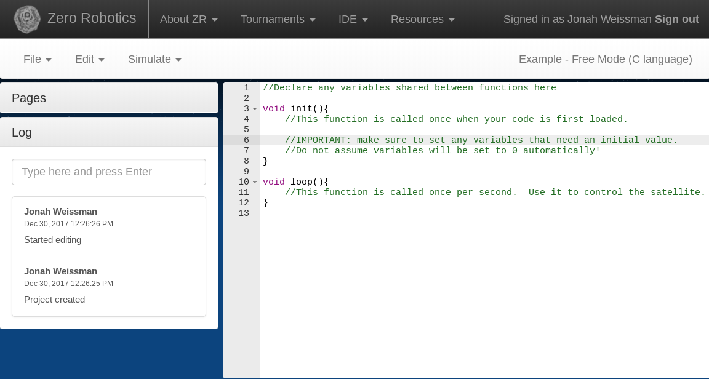

Jonah Weissman - Maker's Portfolio

## The problem
Zero Robotics (ZR) is a competition where teams of 5-25 people compete by writing code to control satellites.
Except for the finals, all participation in the competition happens through [the ZR website](http://zerorobotics.mit.edu/).

### The ZR Integrated Development Environment
In order to compile code and simulate games, participants must use the ZR Integrated Development Environment (IDE).
It is a relatively simple interface:

The IDE is perfectly workable for an individual developer, but when multiple people need to work on the same code, problems arise.
ZR has very stringent codesize limits due to the age of the hardware: only 1500 compiler words.
Most years, my team's final code submission, the result of countless man-hours, is only a few hundred lines.
Unlike in larger projects where team members can work on distinct modules, changes are likely to be conflicting.

### Google Drive

#### collaborative editing
The ZR IDE allows files to be shared through Google Drive.
But there's a catch: when one person changes a document, everyone else looking at the document is immediately scrolled to the top of the document.
This is a significant barrier to collaboration.

Without real-time collaborative editing, work must be done on separate documents or in person, then later combined.
This is a time-consuming and imprecise job.
Furthermore, it requires team members to have deep and broad knowledge of the entire project if they want to contribute at all.

#### versioning
Submitting code to the competition is done through the IDE.
However, the IDE will only tell you *when* you submitted code not what it was.
If you want to preseve the code, you can move it to a new document, but ZR documents cannot be made read-only.
There is no guarrantee that someone won't accidentally change a document, irrevocably overwriting some work.

On one occassion, a team mate accidentally selected the text of an entire document and deleted it.
It would have been permanently gone, except that another team member was having internet problems and was able to copy it before receiving the deletion update. 

Because versioning is such an essential part of software development, my team had a informal versioning system.
Documents were given names and version numbers, such as "3Da 1.2," indicating that this the second minor change to the first major version of the strategy "3Da."
There were a number of problems with this system.

* If two people are both separately working on the next version of the code, how do they name their files?
* How do you tell what changes from one version to the next?
* If you have to revert to an old version, how do you indicate that?
* How can you be sure that a version hasn't changed since you last looked?

This system led to great confusion, and some real mistakes.
On several occassions, the wrong code was submitted.
The biggest problem was the amount of work it took to understand the status of projects as a whole, which was a tremendous barrier for new team members.

## The solution
The problems we encountered -- versioning and collaboration -- have been solved by professional developers.
Unfortunately, the ZR IDE does not natively support any version control system, and, as previously discussed, the collaborative editing is unusable.

### Git
Git is a popular version control system.
After you change the code, you take a "snapshot" of it and you can send that snapshot to a server, where others can see it.
All changes in Git happen on branches, which allows different people to work in parallel on the same code.
Git supports merging branches.

### GitHub
GitHub is a website that hosts Git repositories and provides features like issue tracking and code reviews.

#### pull requests
The central feature of GitHub is the pull request.
A pull request is a suggested change that one makes to the maintainer of a repository.

### My extension
I created a chrome extension (technically a "page action," only enabled for ZR IDE pages) that would provide an interface for tracking versions and collaboration through GitHub.

#### Open Source
I made my extension open source -- any team is free to use or modify my extension.
I believe that the competition should be more about programming challenges than logistical ones.
My hope is that, as more teams adopt it, my extension will develop a community around it of people who will fix bugs and add features.
